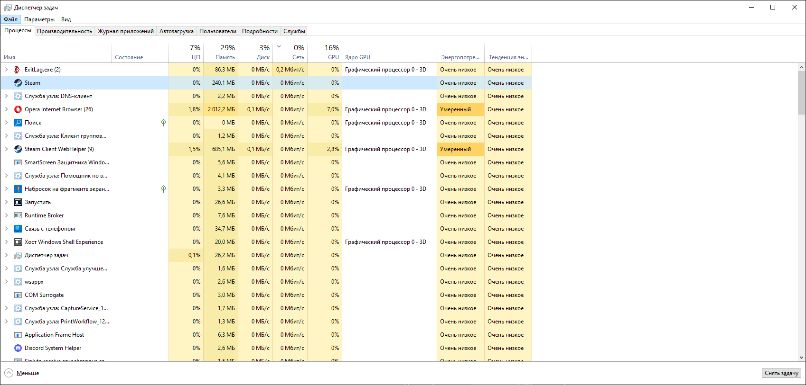

# Типы операционных систем

## Классификация моей Windows

| Признак | Тип | Почему | Наблюдение на ПК |
|---|---|---|---|
| Назначение | Настольная | Для личного использования | Установлена на домашнем ПК |
| Число задач | Многозадачная | Одновременно работают процессы | Диспетчер задач показывает много процессов |
| Пользователи | Многопользовательская | Есть учётные записи | Можно создать несколько пользователей |
| Интерфейс | Графический | Есть рабочий стол и окна | Использую мышь и окна |
| Сфера применения | Общего назначения | Для любых задач | Работа, учёба, игры |
| Поддержка сети | Сетевая | Есть сетевые возможности | Wi-Fi и Ethernet |

## Сравнение 4 ОС

| ОС | Где применяется | Тип по назначению | Многозадачность | Интерфейс | Ключевое отличие |
|---|---|---|---|---|---|
| Windows 11 | Домашние и рабочие ПК | Настольная | Да | Графический | Проприетарная, много софта |
| Ubuntu | Серверы, ПК | Настольная/серверная | Да | Графический/командный | Открытый код |
| Android | Смартфоны | Мобильная | Да | Графический | Оптимизирована под сенсор |
| FreeRTOS | Встроенные системы | RTOS | Да | Командный | Реальное время |

## Вывод

Нельзя считать, что все ОС предназначены для одних и тех же задач, потому что они создаются под разные условия. Настольные ОС ориентированы на удобство пользователя, мобильные — на энергоэффективность и сенсор. Серверные — на надёжность и сеть, а RTOS — на предсказуемое время отклика. Поэтому выбор ОС зависит от задачи.

