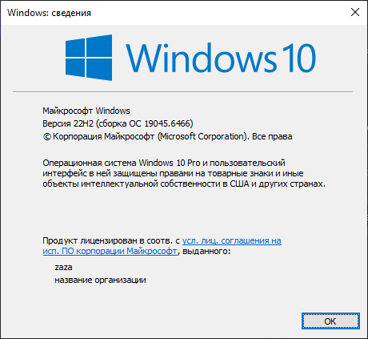
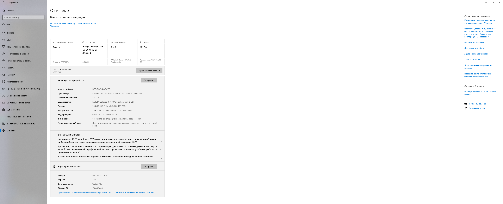
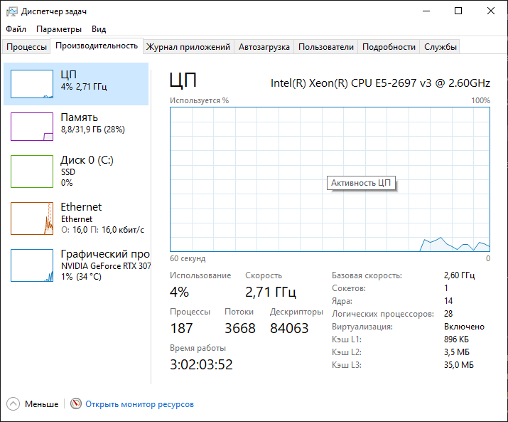
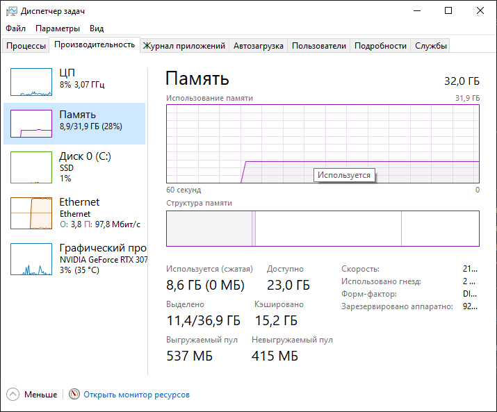
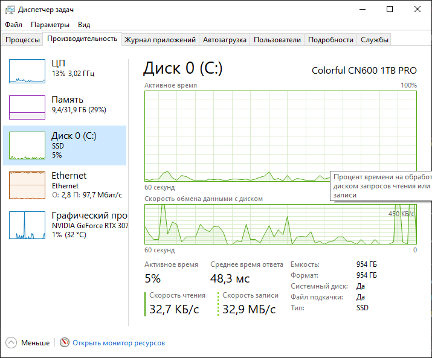
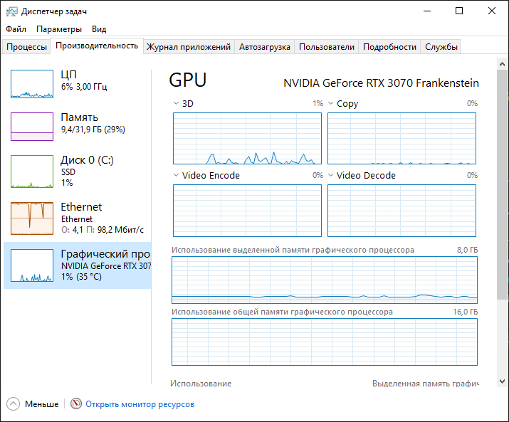
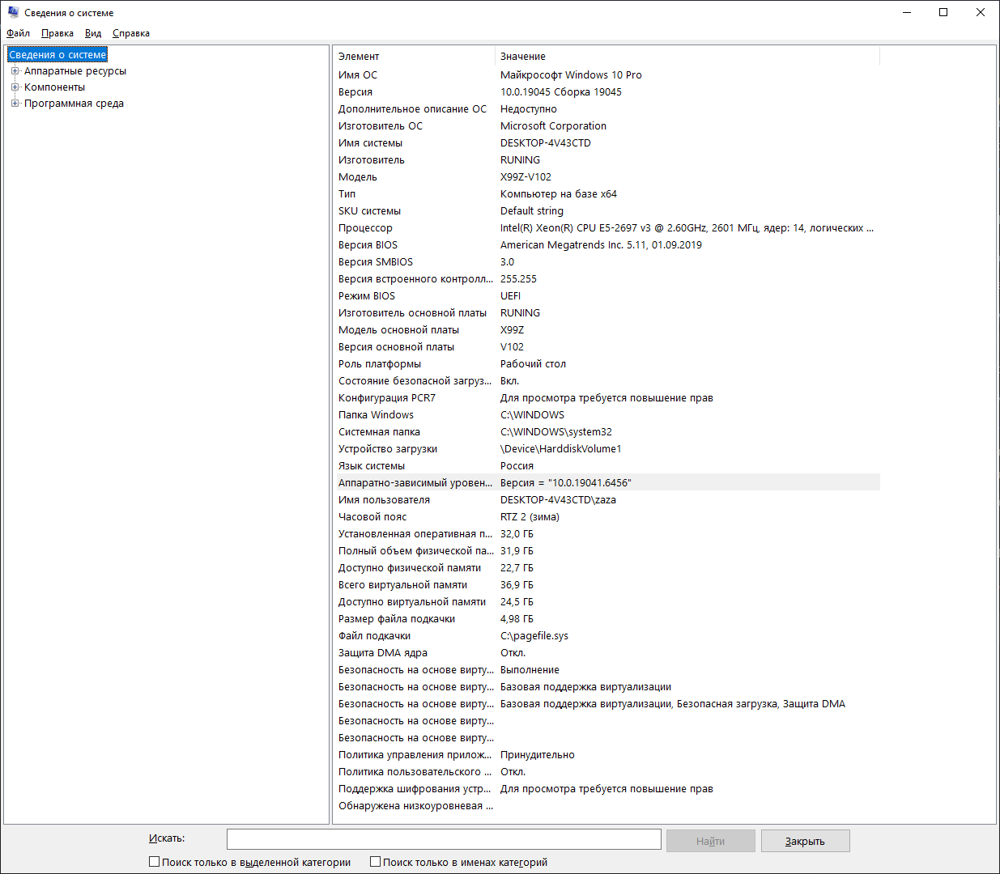

# Паспорт системы

**Дата диагностики:** 2026-09-14
**Инструменты:** winver, Параметры, Диспетчер задач, msinfo32

## Таблица характеристик

| Параметр | Значение |
|---|---|
| ОС | Windows 11 Pro |
| Версия | 23H2 |
| Сборка | 22631.xxxx |
| Архитектура | 64-bit |
| Процессор | (модель) |
| Физические ядра | (число) |
| Логические процессоры | (число) |
| RAM | (объём) |
| Накопитель | SSD, (объём), свободно (объём) |
| GPU | (модель) |
| BIOS/UEFI | UEFI |
| Виртуализация | Включена |

## Скриншоты

*На скриншоте видно редакцию, версию и номер сборки Windows.*

*Параметры → Система → О системе: процессор, RAM, тип системы.*

*Диспетчер задач → Производительность → ЦП: модель, ядра, загрузка.*

*Диспетчер задач → Память: общий объём и текущее использование.*

*Диспетчер задач → Диск: модель, ёмкость, активность.*

*Диспетчер задач → GPU: модель и текущая загрузка.*

*Сведения о системе: ОС, процессор, RAM.*

## Вывод

На основании собранных данных ПК подходит для программирования, виртуальных машин и Linux-сред. Процессор имеет достаточно ядер, RAM достаточен для запуска VM, диск SSD обеспечивает быстродействие, виртуализация включена.
